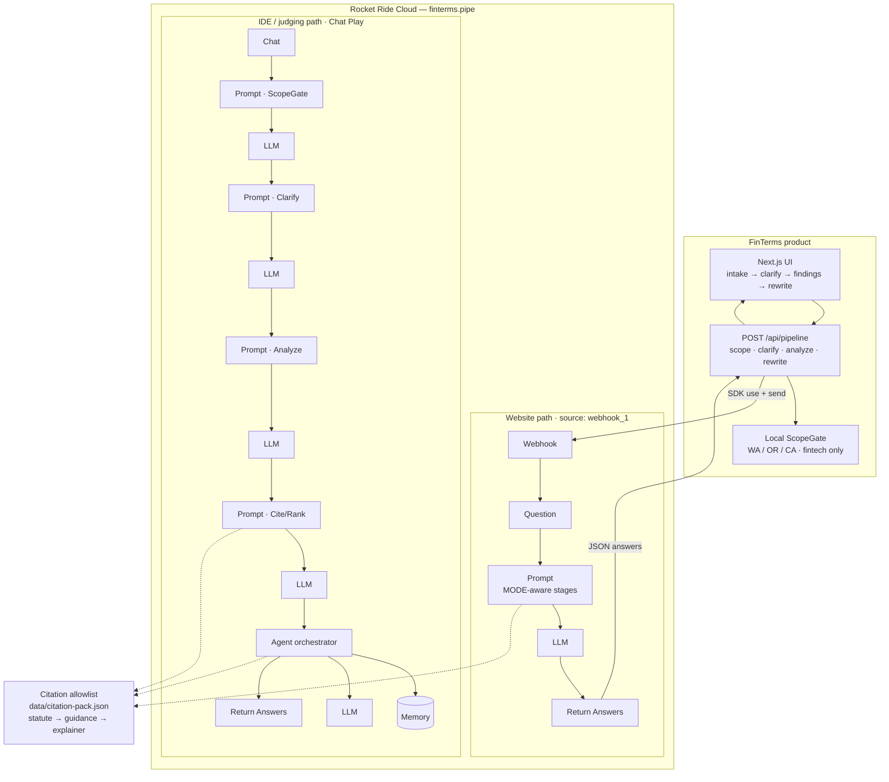

# FinTerms

West Coast terms assistant for fintech startups (**WA / OR / CA**).

**Orchestrator: [Rocket Ride Cloud](https://rocketride.ai)** — pipeline [`finterms.pipe`](./finterms.pipe).

FinTerms helps founders draft, review, and rewrite consumer terms with citation-backed findings. Not legal advice; not a compliance certificate; not a substitute for counsel.

---

## Architecture



### Orchestration story (say this to judges)

| Stage | What Rocket Ride does |
|-------|------------------------|
| **ScopeGate** | Out-of-state / non-finance → polite expand-soon redirect |
| **Clarify** | 3–5 founder questions (product, fees, data, disputes) |
| **Analyze** | Exhaustive first-pass across money, rights, data, future problems, enforceability, regulatory friction, conversion/trust |
| **Cite/Rank** | Attach 1–2 URLs **only** from the allowlisted pack (never invent links) |
| **Rewrite** | Apply accepted suggestions → `prior_draft` + `current_draft` |
| **Agent + Memory** | On the Chat path: validates/consolidates stage JSON across waves |

**Website** hits the **Webhook** row (fast MODE-aware Prompt → LLM).  
**Cursor Play / live graph walkthrough** uses the **Chat** row (explicit Prompt+LLM stages → Agent).

```text
UI ──► /api/pipeline ──► Rocket Ride Cloud (finterms.pipe)
                              │
              ┌───────────────┴───────────────┐
              ▼                               ▼
     Webhook → … → Answers            Chat → Scope → Clarify
     (product)                        → Analyze → Cite/Rank
                                      → Agent(+Memory) → Answers
```

---

## Run

1. Copy `.env.example` → `.env`:
   - `ROCKETRIDE_URI=https://api.rocketride.ai`
   - `ROCKETRIDE_APIKEY=...`
   - `ROCKETRIDE_OPENAI_KEY=...` (LLM nodes in the pipe)
2. `npm install && npm run dev`
3. Open the printed localhost URL — UI calls Rocket Ride via Webhook (`src/lib/rocketride-client.ts`)
4. Or open `finterms.pipe` in Cursor → **Play** on **Chat**

## Docs

[`spec.md`](spec.md) · [`rocketride/PIPELINE.md`](rocketride/PIPELINE.md) · [`docs/SETUP_ROCKETRIDE.md`](docs/SETUP_ROCKETRIDE.md) · [`docs/DEPLOY_NOW.md`](docs/DEPLOY_NOW.md)
